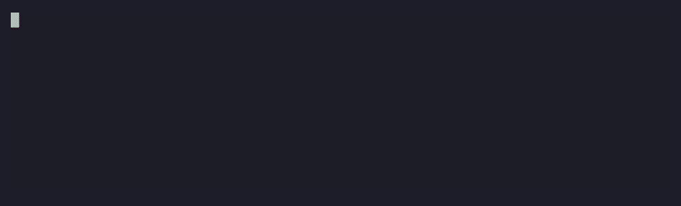
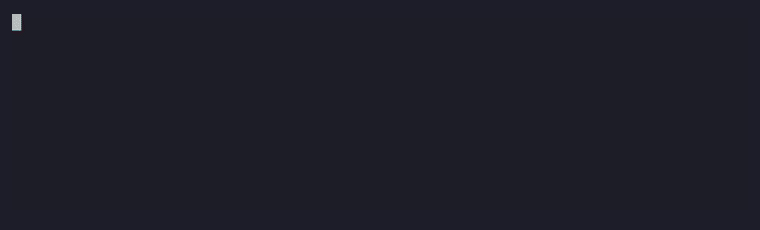
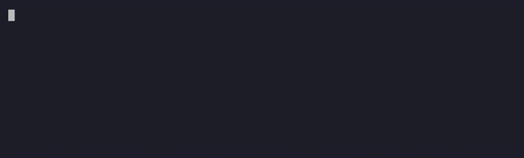

<h1 align="center">h1n054ur-terminal</h1>

<p align="center">
  Your handle, animated, every time a shell opens.<br>
  A system panel that is actually readable. A prompt that gets out of the way.<br>
  bash, zsh and PowerShell. Linux, macOS and Windows.
</p>

<p align="center">
  
  
  
  
</p>


## What you get

**A banner that never plays the same way twice.** Your handle in block letters, driven by [TerminalTextEffects](https://github.com/ChrisBuilds/terminaltexteffects). Ten effects in the pool, one picked at random per shell, each tuned to land in 2.5 to 4 seconds and resolve into the same green to cyan gradient. Ctrl-C skips straight to the static banner.

| matrix | decrypt |
|:-:|:-:|
|  |  |
| **burn** | **beams** |
|  |  |
| **laseretch** | **vhstape** |
|  |  |

Plus rain, unstable, synthgrid and slide.

**A `sys.status` panel** from [fastfetch](https://github.com/fastfetch-cli/fastfetch), boxed, with Nerd Font icons: OS, kernel, uptime, package count, shell, terminal, CPU, memory and disk as bars, load, LAN IP, Tailscale IP, clock. One config, same layout on every OS.

**A two-line [Starship](https://starship.rs) prompt.** User and host, the path, git branch with ahead/behind and dirty counts, the runtime version when you are inside a node, bun, python, go, rust or ruby project, docker context, how long the last command took when it took a while, a clock on the right. Green chevron, or red when the last command failed.

**Shell parity.** The bash script, the PowerShell script and the configs are kept 1:1. Same effects, same timings, same panel, same prompt file.

## Install

Linux (apt, or dnf with EPEL on Rocky, Alma and RHEL) or macOS (Homebrew):

```bash
git clone https://github.com/h1n054ur/h1n054ur-terminal.git
cd h1n054ur-terminal
./install.sh yourhandle
```

Installs figlet, lolcat, cmatrix (not on dnf: EPEL has no package) and fastfetch from your package manager, `tte` and `pyfiglet` user-local through pipx, starship user-local. Appends one marked block to `~/.bashrc`, and to `~/.zshrc` when zsh is your login shell. Nothing else is touched.

Windows (PowerShell, no admin needed):

```powershell
git clone https://github.com/h1n054ur/h1n054ur-terminal.git
cd h1n054ur-terminal
powershell -ExecutionPolicy Bypass -File .\windows\install.ps1 -Handle yourhandle
```

Installs PowerShell 7, starship, fastfetch and Python through winget, `tte` and `pyfiglet` through pip, the CaskaydiaCove Nerd Font per-user, then sets PowerShell 7 with that font as the Windows Terminal default. Appends one marked block to the PowerShell 7 profile.

WSL users want both: the Linux install inside the distro and the Windows install for the font and the host side.

## Over SSH

Install it once on the server. Anyone who connects gets it, with nothing to install on their machine: the animation, the panel and the prompt all run server-side, and the client terminal only draws the output.

What the client terminal decides:

| | needed for | if missing |
|---|---|---|
| Truecolor (24-bit) | gradients, effect colors | colors fall back to the nearest match |
| Nerd Font | icons in the panel and prompt | icons render as empty boxes, everything else is fine |
| 70+ columns | the welcome screen | welcome skips itself, the prompt still loads |

Windows Terminal (the default on Windows 11), iTerm2, WezTerm, Ghostty, Kitty, Alacritty and GNOME Terminal all do truecolor out of the box. So from a stock Windows laptop, `ssh user@server` in Windows Terminal gives you the full animated banner, panel and prompt with no setup. The one thing a stock laptop lacks is a Nerd Font, so the icons show as boxes until you run `windows/install-nerd-font.ps1` (or install any Nerd Font and select it in your terminal).

The welcome screen is tied to the account's shell rc file, so it shows for users whose account ran the installer.

## Use

| command | |
|---|---|
| `welcome` | replay with a random effect |
| `welcome matrix` | force one effect |
| `welcome --list` (`-List` on PowerShell) | list effects |
| `matrix` | cmatrix screensaver, `q` to quit (Linux and macOS, not on dnf systems) |
| `WELCOME_OFF=1` | set in the environment to disable the welcome screen |

The welcome screen runs once per shell: nested shells, tmux panes and non-interactive shells stay quiet. It also skips terminals narrower than 70 columns.

## Make it yours

Everything tunable sits at the top of `bin/welcome` and `windows/welcome.ps1`, and the two are meant to be edited together.

- **Effects.** Each entry is a frame rate plus `tte` arguments. Anything from `tte --help` works, and each effect has its own flags (`tte matrix --help`). Add, remove or retime freely.
- **Gradient.** `GRAD` holds the two hex stops every effect resolves into.
- **Banner font.** Any [pyfiglet](https://github.com/pwaller/pyfiglet) font: `pyfiglet -f <font> yourhandle > ~/.config/welcome/banner.txt`. `ansi_shadow` is the default, `ansi_regular`, `bloody` and `elite` also look good in block-letter mode.
- **Panel.** `config/fastfetch/welcome.jsonc` is a normal fastfetch config. Swap modules, icons, bar glyphs or key width.
- **Prompt.** `config/starship.toml` is a normal starship config.
- **One-liners.** The footer picks from the `tips` list.

## How it fits together

```
new shell
  └─ rc hook (once per shell)
       └─ welcome
            ├─ tte  ── banner.txt ── random effect ── gradient resolve
            ├─ fastfetch --config welcome.jsonc
            └─ footer: handle@host, effect, one-liner
  └─ starship init
```

The GIFs in `docs/` are rendered by [vhs](https://github.com/charmbracelet/vhs) from the tapes in `docs/tapes`. `docs/render.sh` regenerates them.

## Uninstall

Delete the marked block from your rc file or PowerShell profile, then remove `~/.local/bin/welcome` (or `welcome.ps1`), `~/.config/welcome`, `~/.config/fastfetch/welcome.jsonc` and `~/.config/starship.toml`. The packages are yours to keep or remove.

## License

MIT
